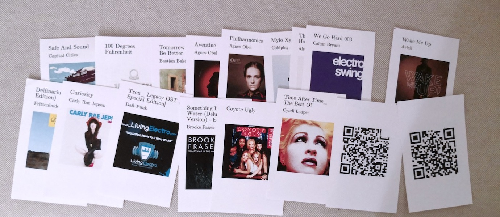

# Cards Jukebox
A music jukebox based on Raspberry Pi and controlled by QR-Code playing cards. 

## State of project

This project is a *proof-of-concept*, which is not finished. 
I published my current state of research to inspire/support other creators. There is no current development.  

## Vision
There is an interactive *item* in the living room with which you can play music. The only input are cards. 
There is a Card for each album or action. To play an album hold the card next to the *item*.  

It should be a modern implementation of an old concept. You browse through your music collection, 
make a choice and hold it next to the jukebox. Just as you did with Compact Disks or tapes. 

## Technical view
There is a tiny computer the the living room. It has an internal memory with compressed music, 
organized in a collection of albums. The music files could also be stored on a NAS. When the computer 
detects a card, it plays the corresponding album. There is a standard 3.5mm audio connector to connect a 
standard audio system (AUX). 

## Cards
The cards have to format of normal playing cards (poker): 89mm x 5.7mm, one side with an album cover, the other 
side has a QR-Code. 

## Components
Required components for this juke box:

* a simple proccess to print nice-looking cards, including cover art and qr-code on the backside. 
* a cheap webcam with adjustable focus (e.g. Logitech C270, needes to be [hacked](https://www.youtube.com/watch?v=v-gYgBeiOVI))
* a Raspberry Pi withing a box
* a sound system and a 3.5mm cable
 

## How you could do it
Obviously you need a small computer, a storage, some kind of ID-reading and an audio output. 

For the computer, the raspberry pi fits the gap, as it is small, cheap, and comes with SD Storage and audio output. (btw, raspberry pi 2 has poor audio quality over aux, but good on hdmi.) 

For identifying the cards, there are two obvious options. RFID and QRCode

### Why RFID
RFID allows contactless communication between the card and the computer. This allowes the 
jukebox the have an abstract shape without any visible interface. :-) 

A RFID-Reader costs arround US$ 50, while the tags cost arround 1$ each. 
If you buy in large quantities, you might find tags for 50 cent each. For a collection of 
300 albums this would be too expensive. 

### Why QR-Code
Printed QR-Codes can be scanned quickly by a webcam. Some data can be stored in the code. 
It's cheap to print a code and it doesn't need any special hardware. 

The disadvantage is that you need a direct line of sight from the webcam to the card. 

*This project focuses on reading a QR-Code, as this is  cheaper an RFID.* 

## Datasource for Metadata and Albumart

### iTunes Export script
[Save Album Art to Album Folder v4.5 Script](http://dougscripts.com/itunes/scripts/ss.php?sp=savealbumart) saves an albumart for each album in the album directory. The filename contains the album and the artist. 

### (Alternative:) Copy paste itunes
iTunes allowes copying metadata directly, just by selecting songs, and pressing cmd-c. This can then be given as input to the printing-proccess. 

# Print Card process
1. Save album artwork from itunes with [Save Album Art to Album Folder v4.5 Script](http://dougscripts.com/itunes/scripts/ss.php?sp=savealbumart)
2. Find all artworks, copy interresting ones to `jukebox-print-input` folder. 
3. Start the PrinterApp in `jukebox-print`, it generates the pdf output
4. print pdf duplex, cut the cards

java pdf library used: https://pdfbox.apache.org

# Play music
1. Start App in  `jukebox-scanner`
1. Scan QR-Code
2. Scan Music Folder
3. Call a media player with the playlist (whole folder)

## Scan code
 * get image from webcam: https://code.google.com/p/v4l4j/wiki/GettingStartedOnRPi
 
 http://www.raspberrypi.org/phpBB3/viewtopic.php?p=195439

## Alternative: motion, only run on detected changes (not used)
http://research.engineering.wustl.edu/~beardj/CtoJava.html

	mkfifo pipe_to_java
	motion -c configfile

config: 

	on_motion_detected "echo %f >pipe_to_java"
	framerate 5

 and 
 
 * parse code with zxing in java

See also: http://www.raspberrypi.org/phpBB3/viewtopic.php?t=11334&p=132028

### Alterantive: Mplayer
Mplayer -slave starts mplayer in the background and reads commands from a fifo-pipe. 

## Other playsers

* http://www.runeaudio.com/about/
* http://www.musicpd.org/
* http://volumio.org/
